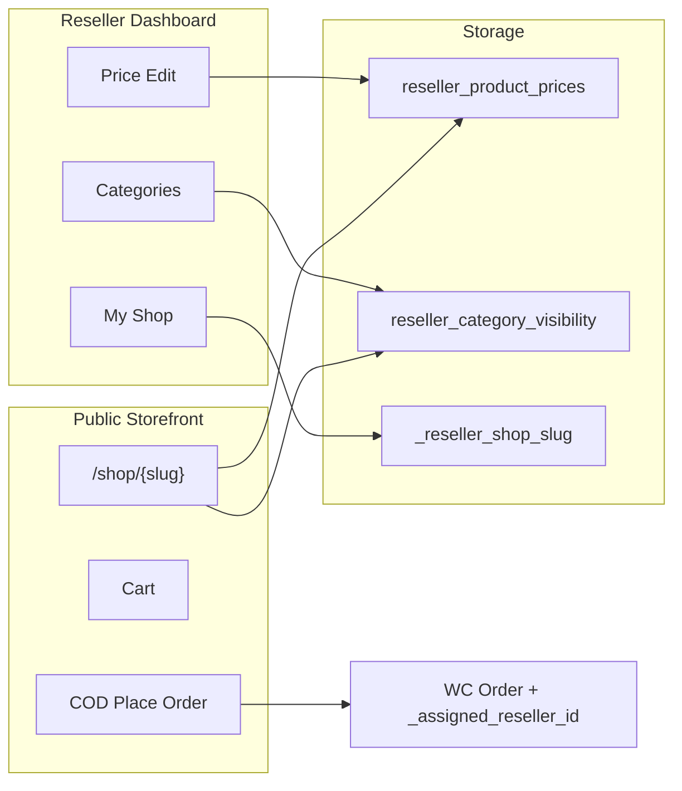

# My Shop + Price Edit + Categories (Mohasagor-style)

Overview: Mohasagor-স্টাইলে My Shop storefront, Price Edit, এবং Categories (Active/De-active toggle) যোগ করা — যাতে reseller নিজের shop URL, selling price, এবং কোন কোন WC category shop-এ দেখাবে সেটা নিয়ন্ত্রণ করতে পারে।

## Todos

- [x] Create reseller_product_prices + reseller_category_visibility tables, shop slug meta, helpers
- [x] Dashboard Price Edit tab + AJAX save; wire defaults into order product search
- [x] Dashboard Categories tab with 3-level Active/De-active toggles for WC product_cat
- [x] Dashboard My Shop tab (slug, copy URL, preview)
- [x] Public /shop/{slug} catalog, cart, COD checkout filtered by active categories
- [x] Remove analysis dumps moha-shop.js / moha-admin.js from plugin root

## Mohasagor analysis (reference)

- Public shop: [mohasagor.com.bd/shop/dropshipping15356](https://mohasagor.com.bd/shop/dropshipping15356)
- Categories panel: [mohasagor.com.bd/dropshipper/categories](https://mohasagor.com.bd/dropshipper/categories)

| Feature | Mohasagor behavior | Our gap today |
|---|---|---|
| Storefront URL | `/shop/:username` SPA | নেই |
| Catalog | Categories, search, product cards | Dashboard-only Products tab |
| Cart + Place Order | Bag → checkout (COD) | Reseller manually creates orders only |
| Price Edit | Per-reseller selling price + profit | শুধু order-time `_resale_price` |
| Categories | 3 columns (Category / Sub / Sub-sub); **Active / De-active toggle** via `/reseller/categories` + `/reseller/category/status/{id}?type=` — reseller category **create করে না**, platform categories on/off করে | WC `product_cat` filter শুধু dashboard Products-এ; per-reseller visibility নেই |

**v1 scope:** public shop + cart/COD checkout + Price Edit + Categories toggles + shop link. Skip wishlist, OTP login, landing builders, sliders, category CRUD (no add/edit/delete of WC terms).

---

## Architecture

**Price resolution:** override → `_reseller_recommended_price` → WC price.

**Category visibility:** default **Active** for all WC `product_cat` terms. Deactivated terms are hidden on My Shop (nav + product filter). Products only appear if they belong to at least one active category (uncategorized products stay visible).

**Commission unchanged:** `resale − base` via `inc/classes/class-reseller-finance.php`.

---

## 1. Data model

- Table `{$wpdb->prefix}reseller_product_prices`: `reseller_id`, `product_id`, `selling_price`, `updated_at`; unique `(reseller_id, product_id)`
- Table `{$wpdb->prefix}reseller_category_visibility`: `reseller_id`, `term_id` (WC `product_cat`), `status` tinyint `1=active` / `0=deactive`; unique `(reseller_id, term_id)`
  - Missing row = active (default)
- User meta `_reseller_shop_slug` (unique); auto-generate e.g. from business name / `reseller{user_id}`
- Helpers in `inc/classes/class-reseller-helper.php`: shop slug/url, selling price, `is_category_active()`, `get_active_category_ids()`
- `dbDelta` on activation / DB version bump

---

## 2. Dashboard: Price Edit

- Tab `price-edit` in `get_dashboard_tabs()`
- Template `templates/dashboard/price-edit.php`: image, name, base, recommended, editable selling price, profit
- AJAX `reseller_save_product_price`; selling price `>=` base
- Order search defaults use override (`class-reseller-orders.php`, `assets/public/js/public-script.js`)

---

## 3. Dashboard: Categories (Mohasagor `/dropshipper/categories`)

- Tab `categories` (label: **Categories**)
- Template `templates/dashboard/categories.php`:
  - Three columns: **Category** / **Sub Category** / **Sub Sub Category** (same hierarchy as `products.php`)
  - Each row: name + Active/De-active badge + toggle button
- AJAX `reseller_toggle_category_status` with `term_id`
- Does **not** create/edit/delete WooCommerce categories — admin still owns the taxonomy

---

## 4. Dashboard: My Shop

- Tab `my-shop`: public URL + copy, slug edit (unique), preview link, approved-only status

---

## 5. Public storefront `/shop/{slug}`

- Rewrite `shop/([^/]+)/?` (+ optional `shop/{slug}/category/{cat-slug}`)
- Template `templates/shop/shop-layout.php`
- Catalog filtered by **active** categories; category nav only lists active terms
- Product detail, cart, COD Place Order → WC order with `_assigned_reseller_id`, `_resale_price`, `_base_price`
- Class `class-reseller-shop.php` + enqueue shop CSS/JS

---

## 6. Files to touch (main)

| Area | Files |
|---|---|
| Tabs / helpers | `inc/classes/class-reseller-helper.php` |
| Shop / prices / categories AJAX | `inc/classes/class-reseller-shop.php` |
| Order defaults | `inc/classes/class-reseller-orders.php`, `assets/public/js/public-script.js` |
| Activation | activator / `class-reseller-setup.php` |
| Templates | `my-shop.php`, `price-edit.php`, `categories.php`, `templates/shop/*` |
| Assets | `inc/classes/class-enqueue-assets.php` |
| Cleanup | Delete `moha-shop.js` / `moha-admin.js` from plugin root if present |

---

## Out of scope (v1)

Wishlist, OTP customer login, order-tracking microsite, landing-page builder, sliders, reseller-created custom categories (only visibility toggles on existing WC terms).

---

## Test plan

- Categories: toggle parent/sub/sub-sub De-active → disappears from My Shop nav; products only in that cat hidden (unless also in another active cat)
- Re-activate → visible again; no row / default = Active
- Price Edit + Place Order + commission as before
- Shop slug uniqueness + 404 for invalid/pending reseller
